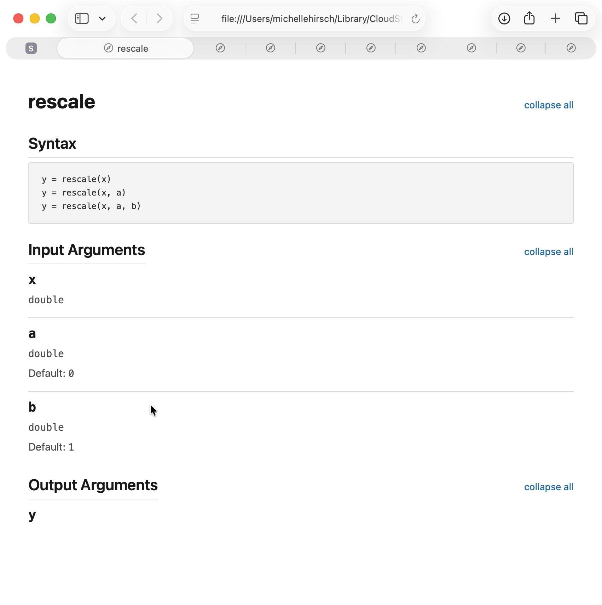
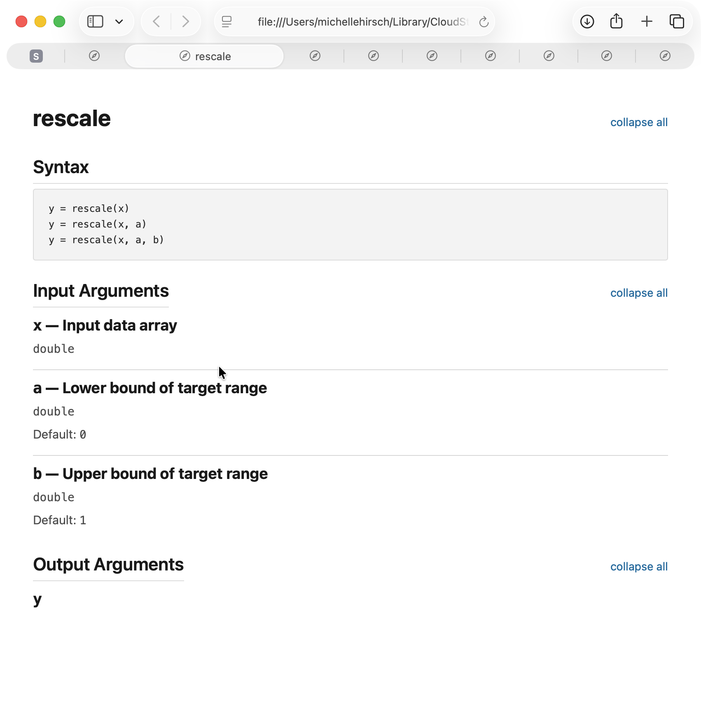
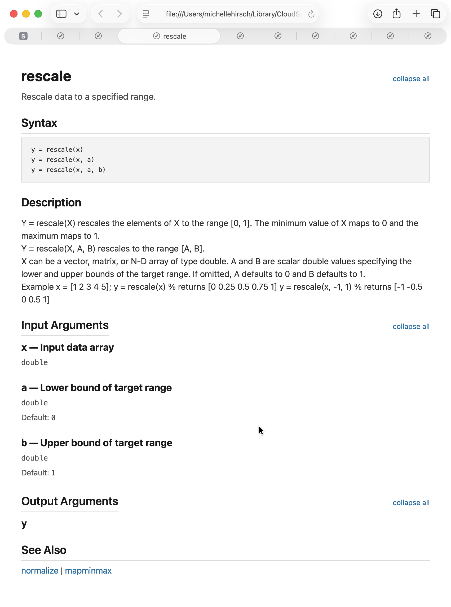
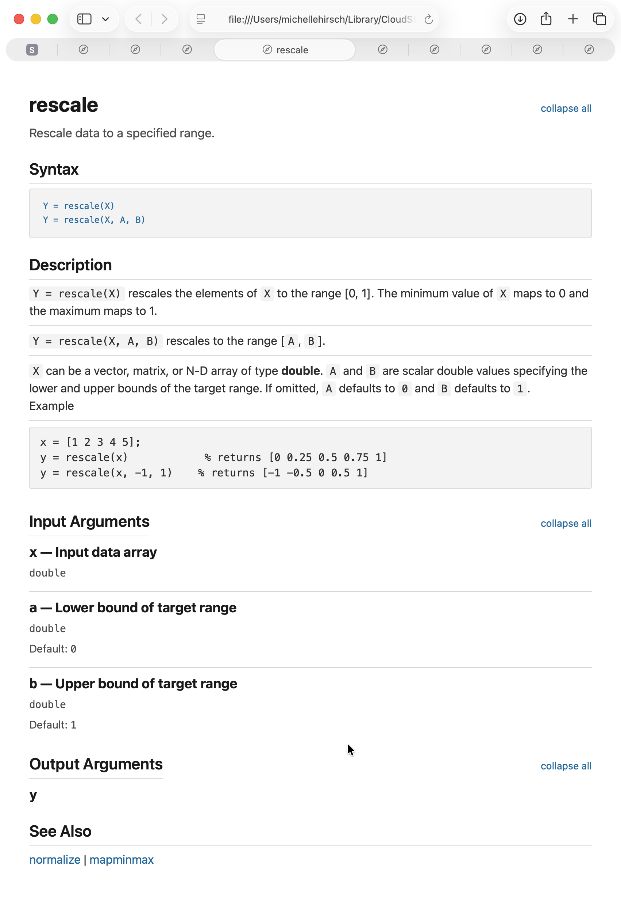
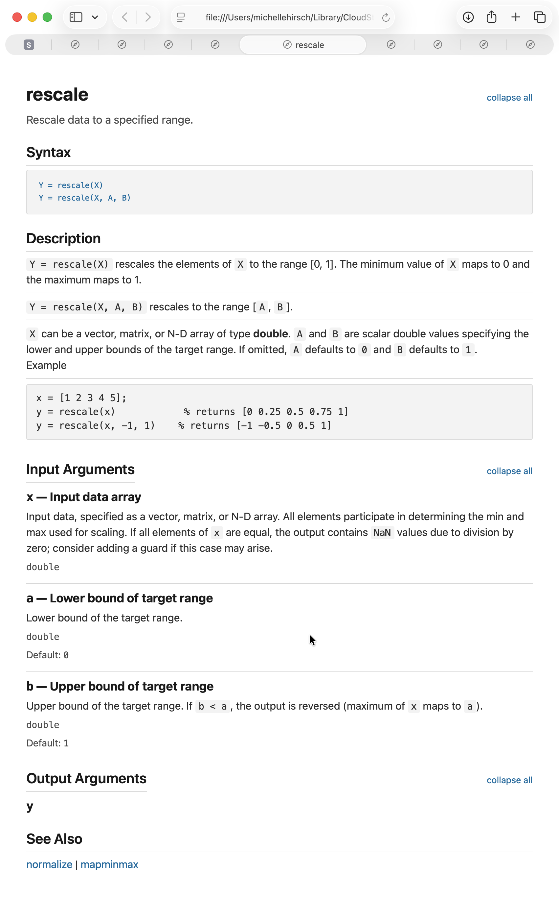
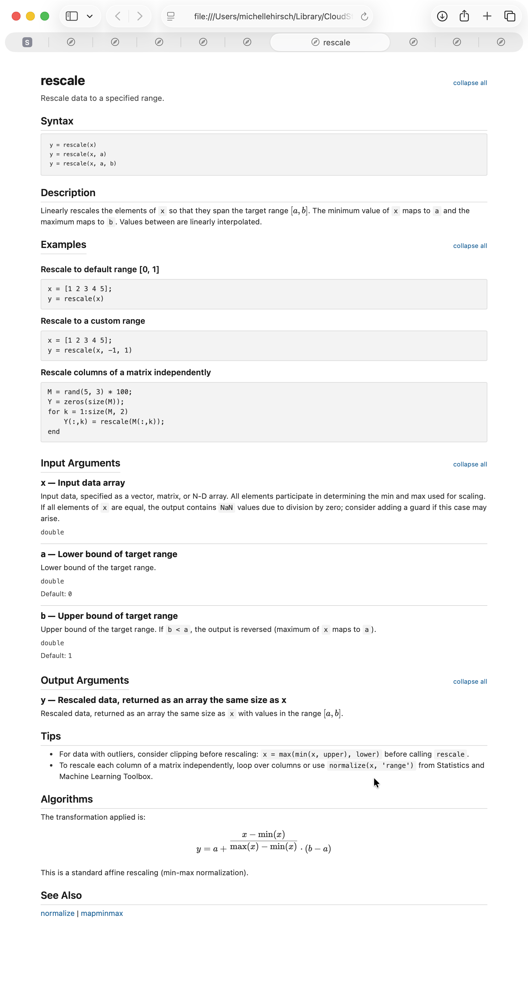
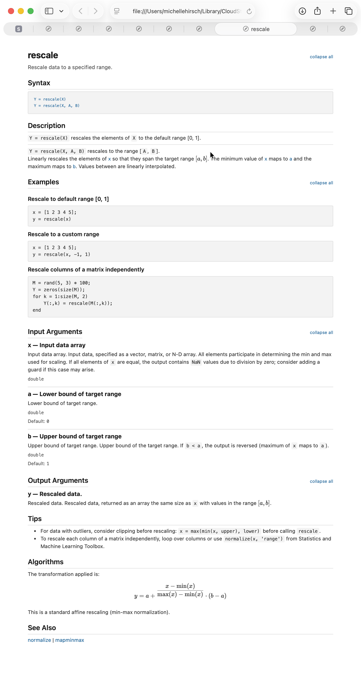
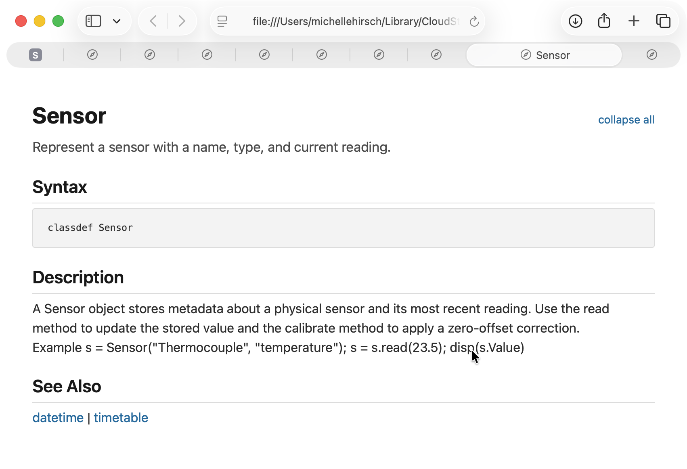
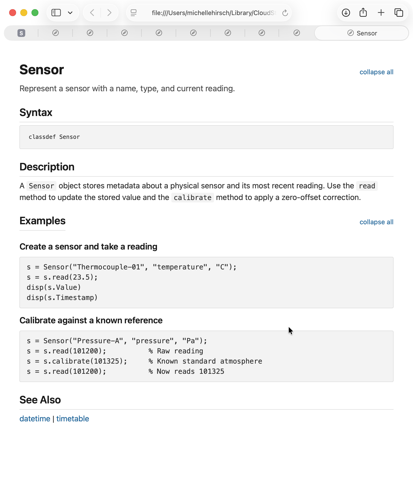

# Getting Started

This framework renders rich HTML documentation from standard MATLAB `.m` file help comments. You don't need to learn a new tool or write in a separate file — just add comments to your code and get styled doc pages that look like official MathWorks documentation.

The key idea is **progressive enhancement**: start with zero effort and add documentation features one at a time. Each step is optional, and every step makes the output better.

We'll walk through the `rescale` function to show how it works, then show how the same model applies to classes.

## Function Documentation

All seven versions below share the same code — only the comments change.

---

### Step 1: Start with just code

A function with an `arguments` block and nothing else:

```matlab
function y = rescale(x, a, b)
arguments
    x        double
    a (1,1)  double = 0
    b (1,1)  double = 1
end
y = a + (x - min(x(:))) ./ (max(x(:)) - min(x(:))) * (b - a);
end
```

The renderer auto-generates a complete doc page from the function signature and `arguments` block alone — title, syntax block, and an input/output argument table with types and defaults:



> [Full source](SampleFiles/rescale/rescale_v0_bare.m) · [Rendered HTML](https://michellehirsch.github.io/matlab_custom_doc_prototype/rescale/rescale_v0_bare.html)

---

### Step 2: Add argument descriptions as inline comments in arguments block

Add argument descriptions by adding a trailing comment on each argument line:

```matlab
arguments
    x        double              % Input data array
    a (1,1)  double = 0          % Lower bound of target range
    b (1,1)  double = 1          % Upper bound of target range
end
```

The argument table now includes short descriptions alongside the auto-generated types and defaults:



> [Full source](SampleFiles/rescale/rescale_v1_args.m) · [Rendered HTML](https://michellehirsch.github.io/matlab_custom_doc_prototype/rescale/rescale_v1_args.html)

---

### Step 3: Add a traditional help block

Add a standard `%` comment block after the `function` declaration — a synopsis, description, calling forms, an example, and `See also`:

```matlab
function y = rescale(x, a, b)
% rescale  Rescale data to a specified range.
%
% Y = rescale(X) rescales the elements of X to the range [0, 1]. The
% minimum value of X maps to 0 and the maximum maps to 1.
%
% Y = rescale(X, A, B) rescales to the range [A, B].
%
% X can be a vector, matrix, or N-D array of type double.  A and B are
% scalar double values specifying the lower and upper bounds of the
% target range.  If omitted, A defaults to 0 and B defaults to 1.
%
% Example
%   x = [1 2 3 4 5];
%   y = rescale(x)            % returns [0 0.25 0.5 0.75 1]
%   y = rescale(x, -1, 1)    % returns [-1 -0.5 0 0.5 1]
%
% See also normalize, mapminmax
```

This is standard MATLAB help — the same thing you'd write today. The help is largely just passed through as-is to populate the Description section, but with a few niceties:
* 2+ spaces (after `% `) of indentation is recognized as a MATLAB code block, so examples are nicely formatted.
* hyperlinks are automatically generated for "see also".
Note that the list of syntaxes and inputs are still automatically generated from the source code. 



> [Full source](SampleFiles/rescale/rescale_v2_plain.m) · [Rendered HTML](https://michellehirsch.github.io/matlab_custom_doc_prototype/rescale/rescale_v2_plain.html)

---

### Step 4: Use Markdown formatting in help block to indicate syntax descriptions and examples

The documentation generator supports standard markdown syntax for formatting. It also uses markdown to allow more explicit definition of the different parts of a documentation page, like syntax descriptions and examples. To define the behavior of a syntax, start a line with the syntax wrapped in backticks (markdown syntax for inline code). Use fenced code blocks (` ```matlab`) to define examples:

```matlab
% `Y = rescale(X)` rescales the elements of `X` to the range [0, 1]. The
% minimum value of `X` maps to 0 and the maximum maps to 1.
%
% `Y = rescale(X, A, B)` rescales to the range [`A`, `B`].
%
% `X` can be a vector, matrix, or N-D array of type **double**.  `A` and
% `B` are scalar double values specifying the lower and upper bounds of
% the target range.  If omitted, `A` defaults to `0` and `B` defaults
% to `1`.
%
% Example
%
% ```matlab
% x = [1 2 3 4 5];
% y = rescale(x)            % returns [0 0.25 0.5 0.75 1]
% y = rescale(x, -1, 1)    % returns [-1 -0.5 0 0.5 1]
% ```
```

Same content, better output — inline code is formatted, the example gets syntax highlighting, and calling forms are detected more precisely. Note that we have one less syntax in the syntax block now because the syntaxes explicitly specified in the help text override the automatically generated list of syntaxes. Note also that we now have hyperlinks from the syntax block to the syntax definitions.


> [Full source](SampleFiles/rescale/rescale_v3_help.m) · [Rendered HTML](https://michellehirsch.github.io/matlab_custom_doc_prototype/rescale/rescale_v3_help.html)

---

### Step 5: Add detailed argument descriptions

For arguments that need more than a one-liner, add multi-line `%` comment blocks *before* each argument in the `arguments` block:

```matlab
arguments
    % Input data, specified as a vector, matrix, or N-D array. All
    % elements participate in determining the min and max used for
    % scaling. If all elements of `x` are equal, the output contains
    % `NaN` values due to division by zero; consider adding a guard if
    % this case may arise.
    x        double              % Input data array

    % Lower bound of the target range.
    a (1,1)  double = 0          % Lower bound of target range

    % Upper bound of the target range. If `b < a`, the output is
    % reversed (maximum of `x` maps to `a`).
    b (1,1)  double = 1          % Upper bound of target range
end
```

The trailing `%` becomes the short description (shown in the collapsed view), and the preceding `%` block becomes the expanded detail. This keeps argument documentation right next to the argument definition:



> [Full source](SampleFiles/rescale/rescale_v4_argdoc.m) · [Rendered HTML](https://michellehirsch.github.io/matlab_custom_doc_prototype/rescale/rescale_v4_argdoc.html)

---

### Step 6: Add structured sections

Use `##` headings in the help block to create recognized page sections. Each section type gets specialized rendering:

```matlab
% ## Output Arguments
%
% `y` — Rescaled data, returned as an array the same size as `x`
% with values in the range $[a, b]$.
%
% ## Examples
%
% ### Rescale to default range [0, 1]
%
% ```matlab
% x = [1 2 3 4 5];
% y = rescale(x)
% ```
%
% ### Rescale to a custom range
%
% ```matlab
% x = [1 2 3 4 5];
% y = rescale(x, -1, 1)
% ```
%
% ## Tips
%
% - For data with outliers, consider clipping before rescaling:
%   `x = max(min(x, upper), lower)` before calling `rescale`.
%
% ## Algorithms
%
% The transformation applied is:
%
% $$y = a + \frac{x - \min(x)}{\max(x) - \min(x)} \cdot (b - a)$$
```

`## Examples` with `###` subsections become separately titled examples. `## Algorithms` renders LaTeX math. `## Tips` renders as a styled bulleted list. The recognized section headings are: `Syntax`, `Input Arguments`, `Output Arguments`, `Examples`, `Tips`, `Algorithms`, `References`, `Version History`, and `More About`. Arbitrary section headings are also permitted; they just don't get special treatment. Manually specifying Syntax, Input Arguments, or Output Arguments in help comments overrides the automatically generated content.  



> [Full source](SampleFiles/rescale/rescale_v5_sections.m) · [Rendered HTML](https://michellehirsch.github.io/matlab_custom_doc_prototype/rescale/rescale_v5_sections.html)

---

### Step 7: Override auto-generation

By default, the Syntax block and Input Arguments section are auto-generated from the `arguments` block. If you need full control, add `## Syntax` or `## Input Arguments` sections in the help block to override them:

```matlab
% ## Syntax
%
% `Y = rescale(X)` rescales the elements of `X` to the default range
% [0, 1].
%
% `Y = rescale(X, A, B)` rescales to the range [`A`, `B`].
%
% ## Input Arguments
%
% `x` — Input data array.
% Input data, specified as a vector, matrix, or N-D array. All
% elements participate in determining the min and max used for scaling.
%
% `a` — Lower bound of target range.
%
% `b` — Upper bound of target range.
% Upper bound of the target range. If `b < a`, the output is reversed
% (maximum of `x` maps to `a`).
```

When present, `## Syntax` replaces the auto-generated syntax block entirely, and `## Input Arguments` replaces the argument descriptions from the `arguments` block. This gives you full control over the exact calling forms and descriptions shown on the page. Manually specifying arguments uses the following syntax:
```matlab
% `argname` — Short description.
% Long description is contained in contiguous comment lines following the 
% argument name.
```




> [Full source](SampleFiles/rescale/rescale_v6_override.m) · [Rendered HTML](https://michellehirsch.github.io/matlab_custom_doc_prototype/rescale/rescale_v6_override.html)

---

## Class Documentation

The same progressive model applies to classes. Properties, methods, and events all support the same comment grammar.

### Traditional class help

A `classdef` with standard help comments, plain properties, and plain method help:

```matlab
classdef Sensor
% Sensor  Represent a sensor with a name, type, and current reading.

    properties
        Name
        Type
        Value
        Units
        Timestamp
        Offset
    end

    methods
        function obj = Sensor(name, type, opts)
        % Sensor  Create a Sensor object.
        ...
```

The renderer creates a class page with a title, synopsis, property table, and method list — all auto-generated from the class definition.



> [Full source](SampleFiles/Sensor/Sensor_v1_plain.m) · [Rendered HTML](https://michellehirsch.github.io/matlab_custom_doc_prototype/Sensor/Sensor_v1_plain.html)

### Full class features

Classes leverage all of the syntax defined for functions. Help pages are generated for each method that is not hidden, protected or private. 

Additionally:
* Describe properties using the same grammar as for function arguments: inline comment in the property definition for a short description, comments on preceding lines for a long description, or override with a ## Properties section in the class help.
* Define labeled property groups by defining properties into multiple `property` blocks. Define the group label with an inline comment in the property block definition

```matlab
classdef Sensor
% Sensor  Represent a sensor with a name, type, and current reading.
%
% A `Sensor` object stores metadata about a physical sensor and its
% most recent reading.
%
% ## Examples
%
% ### Create a sensor and take a reading
%
% ```matlab
% s = Sensor("Thermocouple-01", "temperature", "C");
% s = s.read(23.5);
% ```
```matlab
    properties % Sensor
        %  Display name of the sensor, such as `"Thermocouple-01"`.
        % Used as a label in plots and log output. Must be a nonempty string.
        Name      (1,1) string                  % Sensor display name

        % Sensor category, specified as a string such as
        % `"temperature"`, `"pressure"`, or `"humidity"`.
        Type      (1,1) string                  % Sensor category
    end

   properties  % Sensor readings 
        Value     (1,1) double      = NaN       % Most recent reading
        Units     (1,1) string      = ""        % Measurement units
        Timestamp (1,1) datetime    = NaT       % Time of last reading
        Offset    (1,1) double      = 0         % Calibration offset
    end
```

Property constraints and inline `%` comments auto-generate a detailed property table. The `## Properties` section adds long descriptions. Methods get structured argument documentation just like standalone functions.



> [Full source](SampleFiles/Sensor/Sensor_v3_full.m) · [Rendered HTML](https://michellehirsch.github.io/matlab_custom_doc_prototype/Sensor/Sensor_v3_full.html)

---

## What's Next
- **More sample files**: [SampleFiles/](SampleFiles/) — additional examples including `weightedmean` (7 versions), `smoothts` (complex multi-method function), and `DataLogger` (handle class with events)
- **Browse rendered output**: [GitHub Pages site](https://michellehirsch.github.io/matlab_custom_doc_prototype/) — all sample files rendered as HTML
